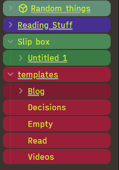
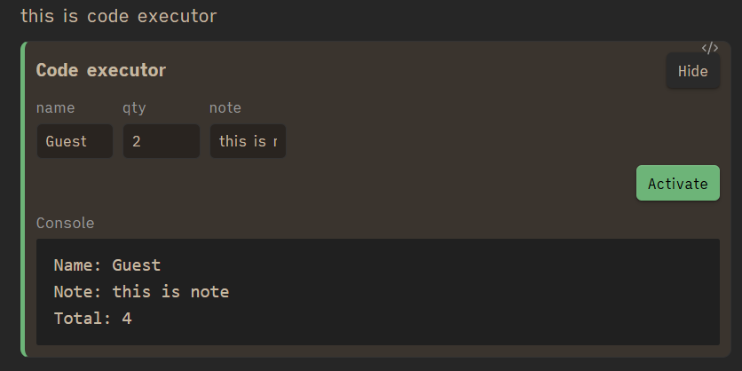
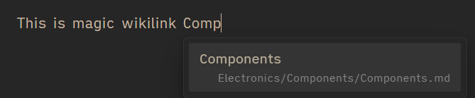

# WOP: Witnull's Obsidian Plugin

WOP is a writing utility plugin that pack multiple essentials plugin that i think will help.

- **Slash commands**: type a trigger like `/` or `>` and insert saved snippets
- ** Variable parser**: auto-replace typed patterns like `->` with symbols like `→`
- **Template importer**: type a trigger like `!` and insert a template file by name
- **File tree coloring**: paint folders and notes in the file explorer with configurable gradients
- **Code Executor**: Allow to execute JS directly in note
- **Magic Wikilink**: Auto suggest related note when typing for reference
- **Template commands**: similar to slash command but insert templates in `/templates` directly to note
- **Auto Note Folder and Rename Image** : When image pasted/drag-n-drop, the current note will convert to Folder Note then rename the pasted image.

## Features


### Slash commands

- Multi-trigger groups (for example `/` and `>`), one character per group
- Enable or disable at module, group, and command level
- Search suggestions by command key and alias
- Multiline command values
- Built-in `{{date}}` token replacement to `YYYY-MM-DD`

Example:

- `/h1` inserts `# `
- `/todo` inserts `- [ ] `
- `>sig` inserts custom signature text

### Variable parser

- Replaces configured patterns while typing
- Rules are sorted by pattern length so more specific rules match first
- Enable or disable per rule

Example defaults include:

- `->` to `→`
- `=>` to `⇒`
- `!=` to `≠`

### Template importer

- Trigger-based template suggestions by file name
- Configurable template folder (default `templates/`)
- One-character trigger symbol (default `!`)
- Inserts full template content at cursor after selecting a suggestion
- Warns in settings when the configured folder does not exist

### File Tree Coloring

- Auto convert file tree color to more colorful, the color are configurable
<p align="center">
  
</p>

### Auto Note Folder and Rename Image

- Auto convert current note (if not note folder yet) to note folder on image pasted and then rename the image as config.

### Code Executor

- Auto convert the JS code in note wrapped in defined code tag to render as a executable UI
- More detail in settings page

Example:
```javascript
// @inputs: name=Guest, qty=1, note
const total = Number(inputs.qty || '0') * 2;
console.log('Name:', inputs.name);
console.log('Note:', inputs.note || '(empty)');
console.log('Total:', total);
```

<p align="center">
  
</p>


### Magic wikilink 

- Auto suggest the related page when typing for wikilink

<p align="center">
  
</p>


## Development

Requirements:

- Node.js 18+
- npm

Install dependencies:

```bash
npm install
```

Production build:

```bash
npm run build
```

## Manual install for testing

Copy these files to your vault plugin folder:

- `main.js`
- `manifest.json`
- `styles.css`

or simply copy `build` to the plugin folder `<Vault>/.obsidian/plugins/`
or simpply edit `esbuild.config.mjs` to directly output `build` to the plugin folder

Then turn off and turn on the plugin in Obsidian for update.

## TODO:

[ ] Encryption per note with AES
